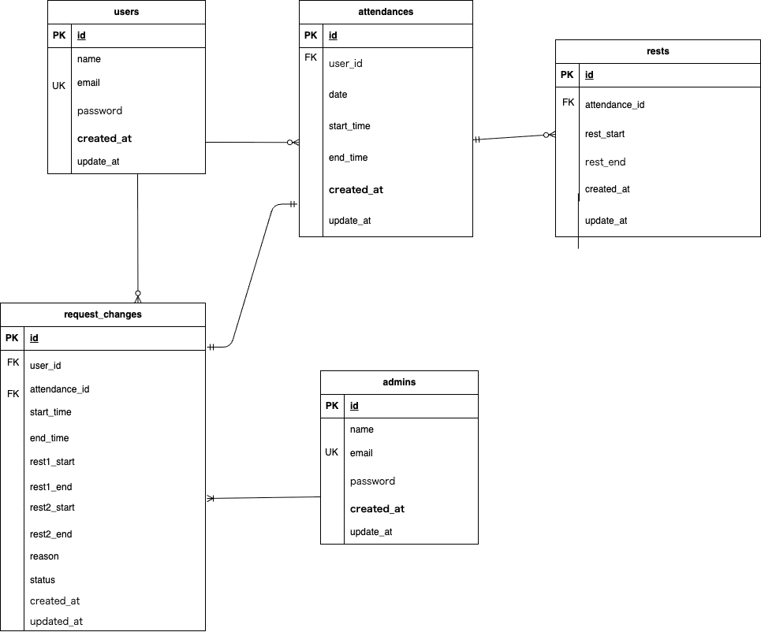

# 勤怠管理アプリ

このアプリは、ユーザーの勤怠を記録・管理するためのWebアプリです。  
打刻、修正申請、管理者承認などの機能を備えています。

---

##  主な機能

### ユーザー側

- ユーザー登録・ログイン機能（認証）
- 勤怠の打刻 (出退勤・休憩)
- 勤怠情報の閲覧 (月別、日別)
- 修正申請機能

### 管理者側

- 管理者登録・ログイン機能 (認証)
- スタッフ一覧の閲覧
- 各スタッフの勤怠情報の確認 (月別、日別)
- 修正申請の承認機能
- 承認待ち、承認済み情報の閲覧

---

##  環境構築

### Dockerビルド

1.git clone https://github.com/auksfie-kc/mogi-laravel-second.git
2.Docker Desktopアプリを立ち上げる
3.docker-compose up -d --build

### Laravel環境構築

1. Laravelのコンテナに入る
docker-compose exec php bash

2. パッケージのインストール
composer install

3. .env.example」ファイルをコピーして.envを作成
cp .env.example .env

4. .envに以下の環境変数を追加

DB_CONNECTION=mysql
DB_HOST=mysql
DB_PORT=3306
DB_DATABASE=laravel_db
DB_USERNAME=（任意のDBユーザー名を入力してください）
DB_PASSWORD=（任意のDBパスワードを入力してください）

5. アプリケーションキーの作成
php artisan key:generate

6. マイグレーションの実行
php artisan migrate

7. シーディングの実行
php artisan db:seed

---

##  ER図

このER図は、スタッフ（users）が複数の勤怠(attendances)を持ち、勤怠には複数の休憩(rests)および修正申請(request_changes)と関連していることを示しています。

---

##  使用技術

| 種類 | 使用技術 |
|------|-----------|
| フロントエンド | HTML / CSS |
| バックエンド | PHP(Laravel 8.0) |
| データベース | MySQL |
| 認証 | Laravel fortify |
| デプロイ | GitHub(コード管理) |

---

## URL
開発環境：http://localhost
phpMyAdmin:http://localhost:8080/

